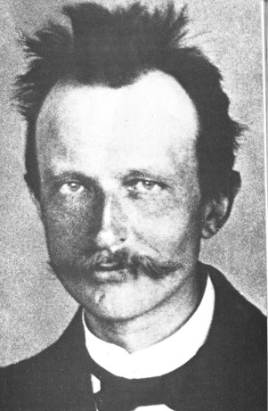

# My First Site

A simple personal webpage built with plain HTML and CSS. No tools or frameworks needed: just a text editor and a web browser.

## Project structure

```
my-first-site/
├── index.html        The webpage itself
├── css/
│   └── style.css     Styling (colors, fonts, layout)
├── js/
│   └── script.js     Behavior (what happens when you click things)
├── images/           Pictures used on the page
│   └── CREDITS.md    Who took each photo, and its license
└── README.md         This file
```

### `index.html`
The main page, holding the **content and structure**: headings, paragraphs, lists, and links. Browsers and web servers look for a file named `index.html` by default, so it serves as the home page.

The buttons for the interactive demos sit in the **Fun Stuff** section, laid out as a grid of boxes (a CSS grid). A few lines in `js/script.js` count the boxes and choose the number of columns to keep the grid as square as possible: 4 boxes make a 2×2 grid, and 5 to 9 boxes use 3 columns. On narrow screens like phones, the boxes stack in a single column. To add a demo, copy one whole `grid-cell` block in `index.html`.

### `css/style.css`
The stylesheet, which controls **appearance**: colors, fonts, spacing, and layout. It's linked from `index.html` with:

```html
<link rel="stylesheet" href="css/style.css">
```

Keeping the styling separate from the content means you can redesign the page without editing the HTML, and any future pages can share the same stylesheet.

### `js/script.js`
The JavaScript file, which controls **behavior**. It powers the "Show me a random photo" button: when you click it, the script picks one of 46 photos at random and shows it in a pop-up window (an HTML `<dialog>` element), along with a caption and a credit to the photographer. Clicking **Next** shows another random photo in the same pop-up. Clicking **Done** closes the pop-up, and so does pressing the Esc key. The script is loaded at the bottom of `index.html` with:

```html
<script src="js/script.js"></script>
```

To change which photos can appear, edit the `images` list at the top of the script.

The script also powers the **"Draw me a fractal"** button. It computes a [Julia set](https://en.wikipedia.org/wiki/Julia_set) pixel by pixel on an HTML `<canvas>`. For each pixel, it repeatedly applies the formula *z → z² + c* and colors the pixel by how many steps the value takes to grow very large. Each click picks a new random value of *c*, which changes the fractal's shape, and a new random color scheme. The value of *c* used appears under the picture.

The fractal starts at a low **depth**, meaning the most times the formula is repeated per pixel before the pixel counts as "inside." At depth 4, it's just a rough blob. Each click of **More depth** doubles the depth (4, 8, 16, … up to 1024) and redraws the same fractal with finer, sharper detail.

Inside points are drawn in a darker shade instead of plain black. In many Julia sets, every inside point gets pulled toward a single point while spiraling around it. The color comes from the angle each point spirals in from, which creates pinwheel patterns. Where that doesn't apply, the color comes from how close the point came to 0.

The **"Zoom into the Mandelbrot set"** button uses the same formula, but each pixel's position is used as *c*, and *z* always starts at 0. The script picks random points until it finds one right at the edge of the Mandelbrot set, which is where the endless detail is, then zooms in on it by a random amount (roughly 10× to 1000×). It has a **More depth** button too, starting at depth 32 because zoomed-in views need more steps before anything appears. Both fractals share one drawing function, `drawEscapeFractal`.

You can dive deeper into the Mandelbrot zoom yourself. **Drag a box** on the picture to recompute just that area so it fills the window, or **click** to zoom in 4× around that spot. **Back** returns to the previous view. Deep zooms may need more depth to show detail, so this pop-up's **More depth** goes up to 4096. Zooming stops at about 3 trillion×, where the computer's numbers no longer have enough precision to tell neighboring pixels apart.

On sharp screens (for example, Windows display scaling at 150% or 200%), the Mandelbrot canvas is computed with extra pixels to match, up to 2× in each direction, so it isn't blurry. **Sharpen** redraws the current view with *antialiasing*: it computes 4 points per pixel and averages their colors, which smooths grainy detail but takes 4× as long. Zooming, **Back**, and **More depth** return to the faster unsharpened drawing, so press **Sharpen** again when you find a view you like. While a picture is computing, the caption shows "Computing…" and the buttons are disabled.

To keep high depths reasonably fast, the drawing code uses *cycle detection*: points inside the set eventually repeat the same values in a loop, so when the code spots a repeat, it stops early instead of running every step.

Finally, the script powers the **"Draw a Sierpiński triangle"** button. The pop-up starts with one solid triangle. Each click of **Next step** splits every triangle into three half-size triangles and leaves the middle empty, up to 8 steps (6,561 triangles). After that, the empty holes in the outer triangle are filled one level at a time, each level in its own color. First comes the 1 big hole in the middle, then the 3 smaller holes, then the 9 after those, and so on. All the triangles in a level are divided together with each click. Each level's triangles are half the size of the level before, so they get one fewer step.

That whole process is "round 1." Round 2 repeats it inside the big center triangle, filling its holes level by level. Round 3 repeats it inside every quarter-size triangle, and so on, with each new level in the next color. It finishes after 7 rounds (120 clicks in all), when the holes are too small to see and the whole triangle is a colorful mosaic. The drawing uses *recursion*, meaning a function that calls itself on each smaller triangle.

### `images/`
Holds image files (photos, icons, graphics). To use one, save it here and point to it from the HTML:

```html

```

The `alt` text describes the image for screen readers and shows up if the image can't load.

The 46 photos used by the random-photo button are named by topic: `sailboat-1.jpg`, `beach-2.jpg`, `rome-3.jpg`, and so on. They cover sailboats, tall ships, early-1900s America's Cup yachts, beaches, mountains, Rome, Nice and nearby Èze, Ireland, and fish (including sport fish: marlin, striped bass, mahi-mahi, snook, red snapper, and flounder). They're openly licensed photos from Flickr, found through [Openverse](https://openverse.org). Most require crediting the photographer, so the pop-up shows a caption and a credit line under each photo. `images/CREDITS.md` lists every photo with its photographer, original page, and license.

To add a photo, save it in `images/` and add a matching entry to the `images` list at the top of `js/script.js`.

### `README.md`
Documentation for the project, written in Markdown.

## How to view the page

Find `index.html` in File Explorer and double-click it to open it in your web browser. After you edit and save a file, refresh the browser to see your changes.

## How to customize it

1. Open `index.html` and replace the placeholder text (your name, tagline, about section, interests, and email).
2. Add a photo to `images/` and uncomment the `` line in the header.
3. Change the colors at the top of `css/style.css` to make the page your own.

## Ideas for later

More fractals that could each get their own button and pop-up:

- **Newton fractal**: pick a random polynomial, run Newton's method from each pixel, and color the pixel by which root it lands on, shaded by how many steps it took. There are no black areas, and the borders between root regions are always intricate. It would fit a "More depth" button well.
- **Burning Ship**: a small change to the Mandelbrot formula (take the absolute values of *z*'s parts before squaring) that gives odd ship-like and flame-like shapes.
- **Fractal flames**: thousands of points placed by a few random drawing rules, which builds up glowing, silky shapes. These are the most beautiful when they work, but random settings sometimes give a dull smear, and the code is more involved.
- **Play / Skip to end buttons** for the Sierpiński triangle, so you don't have to click 120 times.
